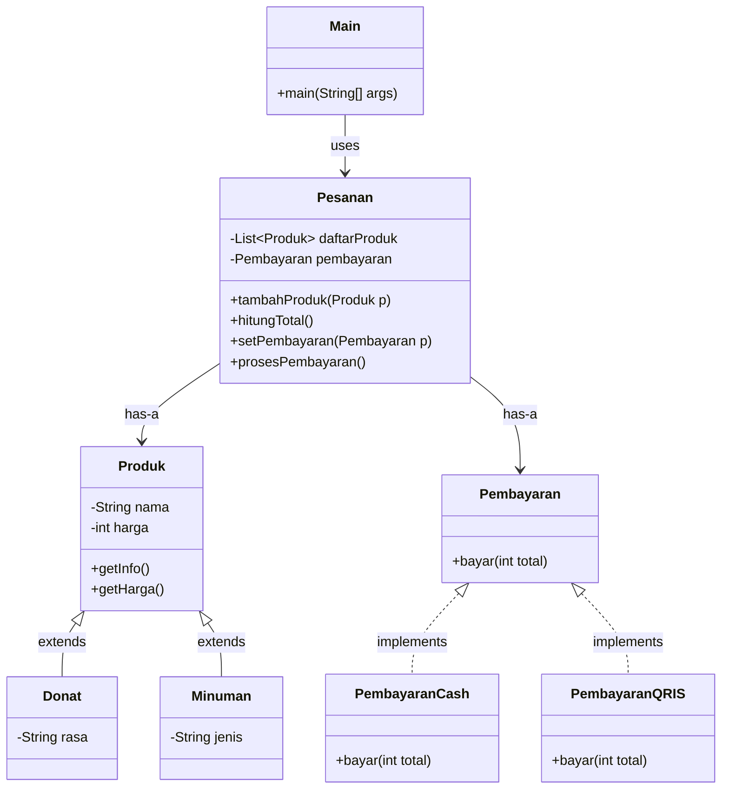

# Sistem Order Pesanan di Cafe

- **Nama:** Jonathan Steven Tjahjaputra
- **NRP:** 5027251036
- **Kelas:** Struktur Data dan Pemrograman Berbasis Objek (B)

## Deskripsi Kasus
Suatu cafe yang memiliki produk donat 3 rasa dan minuman 2 jenis, Owner dari cafe ingin
pemesanan dapat dilakukan dengan cash atau QRIS. Sehingga dibuatlah program pemesanan digital
di `Java` yang dapat mengelola pesanan tersebut.

Program ini berbentuk menu interaktif dimana user (dalam konteks ini, customer) bisa memilih
menu yang ada untuk ditambah ke pesanan, lalu dilanjut memberikan fleksibilitas pembayaran (cash atau QRIS).

## Class Diagram


## Penjelasan Singkat Class

<details>
<summary><strong>Main.java</strong></summary>

```java
import java.util.Scanner;
// class main
public class Main {

    public static void main(String[] args) {

        Scanner input = new Scanner(System.in);
        Pesanan pesanan = new Pesanan();

        int pilihan;

        // menu loop
        do {
            System.out.println("\n==== MENU ====");
            System.out.println("1. Donat Keju");
            System.out.println("2. Donat Coklat");
            System.out.println("3. Donat Vanila");
            System.out.println("4. Teh");
            System.out.println("5. Kopi");
            System.out.println("6. Selesai");

            System.out.print("Pilih: ");

            // ambil input
            pilihan = input.nextInt();

            // pilih produk
            switch (pilihan) {
                case 1:
                    pesanan.tambahProduk(new Donat("Keju"));
                    break;
                case 2:
                    pesanan.tambahProduk(new Donat("Coklat"));
                    break;
                case 3:
                    pesanan.tambahProduk(new Donat("Vanila"));
                    break;
                case 4:
                    pesanan.tambahProduk(new Minuman("Teh"));
                    break;
                case 5:
                    pesanan.tambahProduk(new Minuman("Kopi"));
                    break;
                case 6:
                    break;
                // input invalid
                default:
                    System.out.println("Pilihan tidak valid!");
                    break;
            }

        } while (pilihan != 6);

        // tampil pesanan
        System.out.println("\n=== PESANAN ===");
        pesanan.tampilkanPesanan();

        // pilih pembayaran
        System.out.println("\nPilih Pembayaran:");
        System.out.println("1. Cash");
        System.out.println("2. QRIS");

        int bayar = input.nextInt();

        // set metode
        if (bayar == 1) {
            pesanan.setPembayaran(new PembayaranCash());
        } else if (bayar == 2) {
            pesanan.setPembayaran(new PembayaranQRIS());
        } else {
            System.out.println("Pilihan tidak valid, default ke Cash.");
            pesanan.setPembayaran(new PembayaranCash());
        }

        // proses akhir
        pesanan.prosesPembayaran();
        input.close();
    }
}
```
</details>

`Main.java` adalah class utama yang menjalankan program dan mengatur interaksi user melalui menu.

<details>
<summary><strong>Produk.java</strong></summary>

```java
class Produk {

    // atribut produk
    protected String nama;
    protected int harga;

    // konstruktor
    public Produk(String nama, int harga) {
        this.nama = nama;
        this.harga = harga;
    }

    // info produk
    public String getInfo() {
        return nama + " - Rp" + harga;
    }

    // ambil harga
    public int getHarga() {
        return harga;
    }
}
```
</details>

`Produk.java` adalah class dasar yang menyimpan atribut umum produk seperti nama dan harga, serta method untuk menampilkan informasi produk.

<details>
<summary><strong>Donat.java</strong></summary>

```java
class Donat extends Produk {
    private String rasa;
    public Donat(String rasa) {
        super("Donat " + rasa, 5500);
        this.rasa = rasa;
    }
}
```

</details>

`Donat.java` adalah turunan dari `Produk,java` yang merepresentasikan donat dengan berbagai rasa.

<details>
<summary><strong>Minuman.java</strong></summary>

```java
class Minuman extends Produk {
    private String jenis;
    public Minuman(String jenis) {
        super(jenis, 3500);
        this.jenis = jenis;
    }
}
```

</details>

`Minuman.java` juga merupakan turunan dari `Produk.java` yang merepresentasikan jenis-jenis minuman.

<details>
<summary><strong>Pembayaran.java</strong></summary>

```java
interface Pembayaran {
    void bayar(int total);
}
```

</details>

`Pembayaran.java` adalah interface yang mendefinisikan method pembayaran (bayar) sebagai abstraksi.

<details>
<summary><strong>PembayaranCash.java</strong></summary>

```java
class PembayaranCash implements Pembayaran {
    @Override public void bayar(int total) {
        System.out.println("Bayar tunai: Rp" + total);
    }
}
```

</details>

`PembayaranCash.java` adalah implementasi dari `Pembayaran.java` untuk pembayaran secara tunai.

<details>
<summary><strong>PembayaranQRIS.java</strong></summary>

```java
class PembayaranQRIS implements Pembayaran {
    @Override public void bayar(int total) {
        System.out.println("Membuat QR...");
        System.out.println("Bayar via QRIS: Rp" + total);
    }
}
```

</details>

`PembayaranQRIS.java` juga merupakan implementasi dari `Pembayaran.java` untuk pembayaran melalui QRIS.

<details>
<summary><strong>PembayaranQRIS.java</strong></summary>

```java
import java.util.ArrayList;

// class pesanan
class Pesanan {

    private ArrayList<Produk> daftarProduk = new ArrayList<>();
    private Pembayaran pembayaran;

    // tambah produk
    public void tambahProduk(Produk p) {
        daftarProduk.add(p);
    }

    // hitung total
    public int hitungTotal() {
        int total = 0;

        for (Produk p : daftarProduk) {
            total += p.getHarga();
        }

        // diskon kecil
        if (total > 10000) {
            total -= 1000;
        }

        return total;
    }

    // set pembayaran
    public void setPembayaran(Pembayaran pembayaran) {
        this.pembayaran = pembayaran;
    }

    // proses bayar
    public void prosesPembayaran() {
        int total = hitungTotal();
        System.out.println("Total: Rp" + total);
        pembayaran.bayar(total);
    }

    // tampil pesanan
    public void tampilkanPesanan() {
        for (Produk p : daftarProduk) {
            System.out.println(p.getInfo());
        }
    }
}
```

</details>

`Pesanan.java` adalah class yang mengelola daftar produk yang dipesan, menghitung total harga, serta menangani proses pembayaran.

## Contoh Output


## Prinsip OOP yang diterapkan
### 1. Encapsulation
- Atribut seperti `nama` dan `harga` disimpan dalam class `Produk`
- Akses data dilakukan melalui method seperti `getInfo()` dan `getHarga()`
- Data tidak diakses langsung dari luar class

### 2. Inheritance
- Class `Donat` dan `Minuman` merupakan turunan (Mewarisi) dari `Produk`
- Menggunakan keyword `extends`
- Menghindari duplikasi kode karena atribut dan method diwariskan

### 3. Polymorphism
- Method `bayar()` memiliki 2 bentuk implementasi yaitu `PembayaranCash` dan `PembayaranQRIS`
- Pemilihan method dilakukan secara dinamis :
```java
pesanan.setPembayaran(new PembayaranQRIS());
```

### 4. Abstraction
- Interface Pembayaran hanya mendefinisikan method `bayar()`
- Detail implementasi disembunyikan dalam class turunan
- User hanya mengetahui “cara pakai”, bukan “cara kerja”

## Keunikan Fitur
- Berbentuk menu interaktif sehingga user tidak perlu menginput nama pesanan satu-satu
- Error-handling jika input menu invalid (diluar 1/2/3/4/5/6)
- Menyimpan total harga pesanan secara otomatis
- Memberi ruang fleksibilitas dalam pilihan pembayaran (Cash/QRIS)
- Mendefault pembayaran ke cash apabila input metode pembayaran invalid (diluar 1/2)
